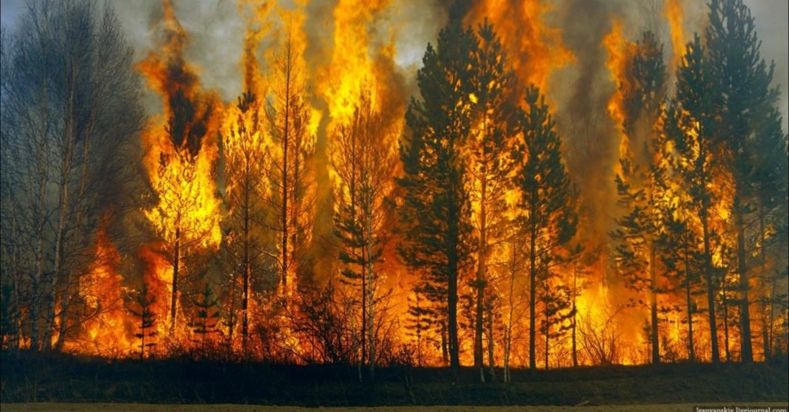
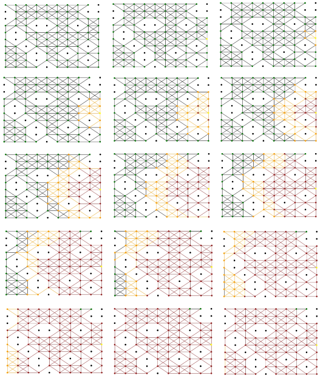
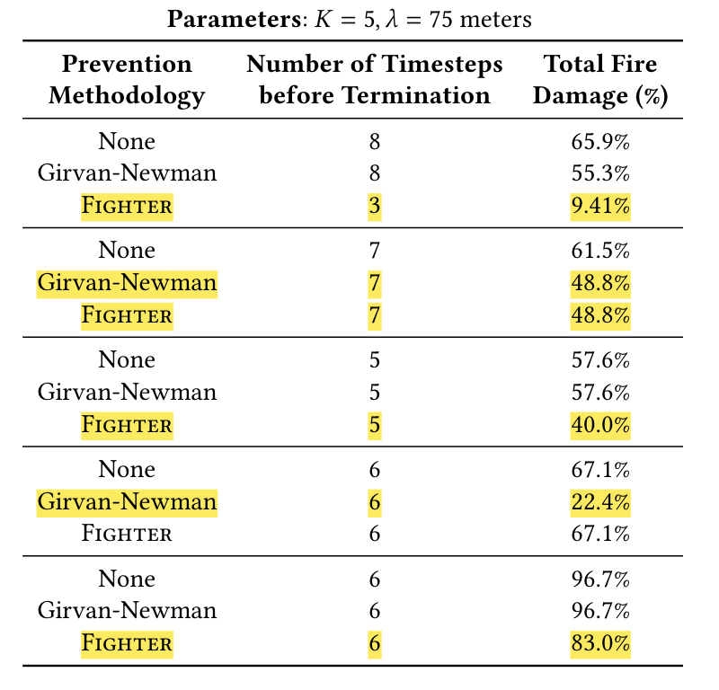

# Forest Fire Analytics

<b>Img Src</b>: https://www.dailysabah.com 

Forest fires have been common environmental issues that have impacted millions of lives and natural resources. Thus, an in-depth study of the behavior of wildfires is critical in devising preventive strategies to control its rapid spread. However, despite a significant amount of work that has been done in the literature, developing an effective fire spread model is still a challenge.  
  
Our goal is to design a model of forest fire propagation and be able to simulate the behavior of cascading fires in the forest. More specifically, we propose <b>INCINERATE</b> (<b><u>IN</u></b>formation <b><u>C</u></b>ascades <b><u>I</u></b>n <b><u>NE</u></b>tworkX <b><u>R</u></b>epresenting <b><u>A</u></b> Forest of <b><u>T</u></b>rees <b><u>E</u></b>ngulfed by flames), a fire simulator in forest network graphs. A Linear Threshold model, together with various mathematical models from literature, were employed in this simulation that “determines” the behavior of fire propagation. We then propose fire prevention strategies in order to mitigate the damage of forest fires. In particular, we propose the <b><u>FIGHTER</u></b> (<b><u>F</u></b>orest fire <b><u>I</u></b>nhibition via a <b><u>G</u></b>irvan-Newman <b><u>H</u></b>euristic <b><u>T</u></b>hrough a neighborhood-based <b><u>E</u></b>dge-<b><u>R</u></b>emoval Approach) algorithm, a neighborhood-based edge-removal scheme utilizing the Girvan-Newman heuristic. It has been found that our edge-removal algorithm in forest networks can reduce the impact of wildfires by as much as 85% than if there were no preventive measures.  
  
This paper discusses in-detail the models, algorithms and results of our experiments, as well as suggested further research directions.

## Simulation

This is a sample run of the forest fire propagation simulation (sequence begins in the upper left corner going across, then down). The figure in the upper left corner panel is the initial state of the system where none of the forests are damaged (all non-burnt forests are green and all those fire zones whose states will never change are black). In the figure beside it shows a randomly selected node in the forest (colored yellow) where it serves as the source of the fire. In the sequences that follow, we see that fire propagates accordingly to our algorithms (where orange nodes represent forests that are burning and brown nodes represent forests that are burnt out). In the final few panels of the simulation, we have seen that the number of burning forests has remained the same and therefore serves as the stopping criterion of the fire propagating algorithm.

## Results

After simulating our forest fire propagation algorithm <b>INCINERATE</b>, we propose fire prevention strategies on our forest network graph. The first one is through an edge-removal technique that detects communities, called the Girvan-Newman (GN) approach. This will serve as a benchmark for another edge-removal algorithm we propose, <b>FIGHTER</b>. Our algorithm, similar to GN uses edge-betweenness scores to prune out edges. The distinction of our proposed algorithm is that we intend to consider (local) neighborhood-based edge-removal.

  
A table of results of a sample of five simulations for the various methods of fire prevention strategies. The algorithm highlighted in yellow gives the best performing prevention scheme for each simulation.

We plot Simulation 1 of the above as seen below. It can be seen that our algorithm turns out to be superior than the GN method, and that applying our method can reduce forest fire damage by as much as 85%

